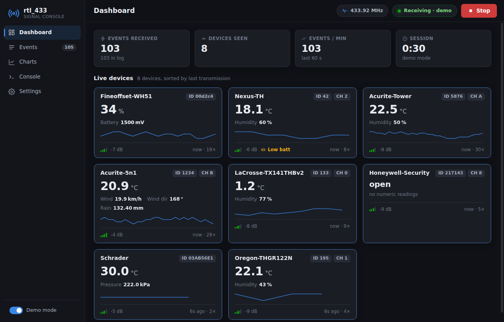

# rtl_433 GUI

A polished desktop GUI for [rtl_433](https://github.com/merbanan/rtl_433), built for
Windows (runs on Linux/macOS too). It wraps the `rtl_433` command-line receiver and
turns its JSON output into a live dashboard.



## Features

- **Dashboard** — live cards for every device heard, with headline reading,
  sparkline, signal bars, low-battery warnings and last-seen age. Click a card to
  chart it.
- **Events** — filterable, pausable log of every decoded transmission with
  expandable raw JSON, and CSV / NDJSON export.
- **Charts** — time-series of any recorded metric (temperature, humidity, wind,
  pressure…), overlaying up to three devices, with crosshair tooltips and
  15 min / 1 h / 6 h / all ranges.
- **Console** — the raw rtl_433 stderr stream for troubleshooting.
- **Settings** — SDR device, frequency (with band presets and hopping), sample
  rate, gain, PPM correction, per-protocol decoder toggles (all 378 protocols,
  searchable), units, and free-form extra arguments.
- **Demo mode** — replay realistic simulated sensor traffic with no SDR or
  rtl_433 install needed. Great for a first look.

The GUI runs `rtl_433 -F json` as a child process and parses its line-delimited
JSON output; settings map 1:1 onto rtl_433 command-line options, and the exact
command line used is always shown in the Console view.

## Running from source

Requires [Node.js](https://nodejs.org) 20+.

```sh
cd gui
npm install
npm start          # normal mode (expects rtl_433 on PATH or set in Settings)
npm run start:demo # demo mode, no hardware needed
```

## Installing on Windows

Grab **`rtl_433 GUI Setup <version>.exe`** from the repository's
[Releases](../../../releases) page (or the portable `.zip` if you prefer no
installer), run it, and point **Settings → Receiver** at your `rtl_433.exe` if
it isn't on the `PATH`.

## Building the Windows installer

```sh
cd gui
npm install
npm run dist       # produces dist/rtl_433 GUI Setup <version>.exe (NSIS) + portable zip
```

(On Linux/macOS the NSIS step needs Wine; the portable Windows zip builds
everywhere.)

The GitHub Actions workflow `.github/workflows/build-gui.yml` builds the
installer on every push that touches `gui/`, uploading it as a build artifact —
and pushing a tag like **`gui-v0.1.0`** publishes it automatically as a GitHub
Release with the `.exe` attached.

### Bundled rtl_433.exe

Installer and zip builds **ship with a statically linked `rtl_433.exe`**
cross-compiled from this repository's own sources
(`gui/scripts/build-rtl433-win64.sh`, run automatically in CI) — no separate
rtl_433 install is needed. The app looks for `rtl_433.exe` in this order:

1. the path configured in **Settings → Receiver**,
2. the bundled copy (`resources/rtl_433/rtl_433.exe`, or `gui/vendor/rtl_433/`
   when running from source),
3. `%ProgramFiles%\rtl_433\rtl_433.exe` (and `C:\rtl_433\rtl_433.exe`),
4. next to the app's resources,
5. `rtl_433` on the `PATH`.

Note: your RTL-SDR dongle still needs the WinUSB driver — install it once with
[Zadig](https://zadig.akeo.ie/) if rtl_433 reports no device found.

## Development notes

- `main/` — Electron main process: window, settings persistence
  (`settings.json` in the user-data dir), the rtl_433 process manager and the
  demo-mode synthesizer. No runtime npm dependencies.
- `renderer/` — vanilla ES-module UI, no framework. The renderer is sandboxed
  (`contextIsolation`, no `nodeIntegration`) and talks to the main process only
  through the `window.rtl433` bridge in `main/preload.js`.
- `data/protocols.json` — decoder list harvested from `rtl_433 -R`; regenerate
  with a current binary when protocols change upstream.
- Screenshots for docs/CI: `RTL433_SCREENSHOT_DIR=out RTL433_DEMO_SPEED=20
  electron . --demo` captures every view and exits.
